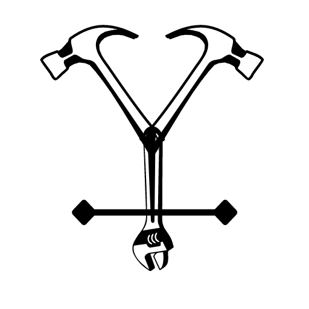

vulcan: ECS Deployments done right
=================================

<!-- toc -->
* [Description](#-description)
* [Getting Started](#-getting-started)
* [Features](#-features)
<!-- tocstop -->

#  Description
This is a CLI utility for deploying containers on AWS Elastic Container Service built on yargs. Want to have blue-green deployments with rollbacks? Want to perform a canary deployment? Tired of using ECS Deployment Controller? Don't want to use CodeDeploy? Use vulcan to control the end to end depoyment lifecycle of your application.

# Features
* **Blue Green and Canary Deployments** - Vulcan has been built to support blue green and canary deployments on ECS. Using the EXTERNAL deployment controller type, you can control how your blue green deployments happen, when to shift traffic and when to rollback.

* **Integration with CI Tools** - Vulcan has been designed to run on any CI Server including but not limited to Jenkins, Gitlab, TeamCity. If there is nodejs installed on a machine, it can run vulcan. The easiest way to get started is to install this tool on your local machine and start deploying services on ECS.

* **Easy Integration with IaaC Tools** - Vulcan reads and writes files in JSON. Use your IaaC tools to provision infrastructure, output a simple json file and load this into vulcan to begin deployments. Easy, peasy!

* **Clean and focused** - Vulcan commands from decoupled from each other and can run individually. You can choose a set of commands which fit your use case. See [Commands](#-commands) for more details.

* **Put the 'Dev' back into DevOps** - Vulcan enables you to give control of deployments back to the Developers. Developers can edit task definitions in a central repository and vulcan can be configured to pick up those task definitions and deploy.

# Requirements
Currently, Node 14+ is supported. We support the [LTS versions](https://nodejs.org/en/about/releases) of Node.

